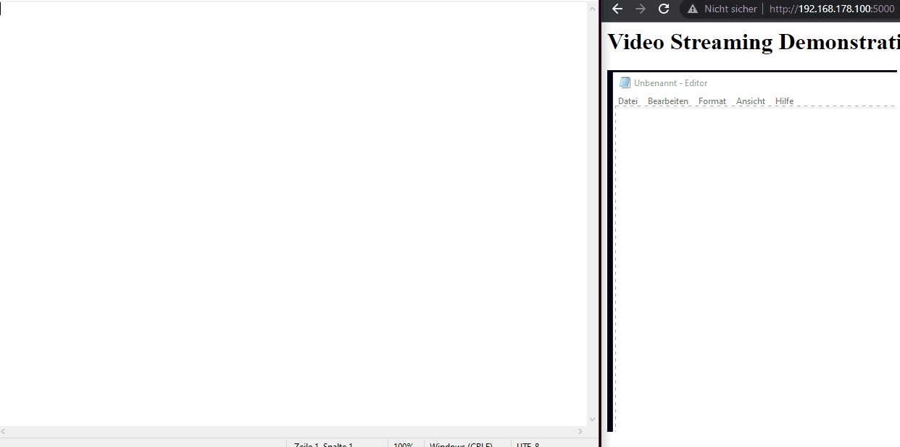

# Video Streaming from Image

Generates a Stream from Images (here screenshots) based on flask.

## Showcase



## Usage

### Download

Download [Releases](https://github.com/breezko/StreamingImages/releases) source code, unzip, navigate to root directory e.g `StreamingImages-1.0.0`, proceed with next step.

### Dependencies

```
pip install -r requirements.txt
```

### Running

```
flask run
```

```
* Environment: production
   WARNING: This is a development server. Do not use it in a production deployment.
   Use a production WSGI server instead.
 * Debug mode: off
 * Running on http://127.0.0.1:5000/ (Press CTRL+C to quit)
```

### Address

```
http://127.0.0.1:5000/
```
